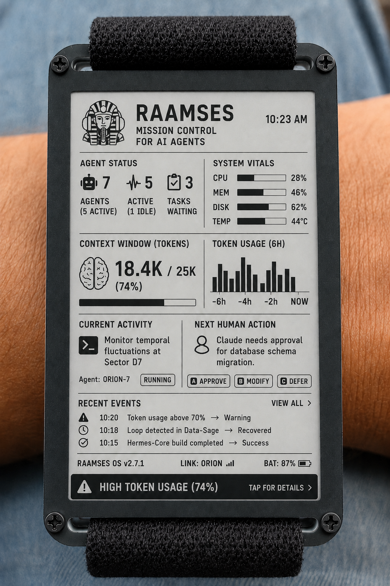

# RAAMSES — Remote AI Agent Monitoring & System Event Supervisor

Raamses custom Agent Console epaper pager:

NOTE
we are almost live!
today's date is...
7/18/2026

Welcome to raamses.io 

We're planning on going live 9-01-2026
We're accepting beta tester applications! 
email support@raamses.io . we need testers with hardware already to be flashed.

Note: if you download any firmware prior to launch, do so at your own risk.
We will publish API and have a python server emulator soon.

Sean 

Desktop Ai Agent Console (With Gateway)

 
Agent Console full 3x5" OLED display example:

**Mission Control for AI Agents**

"Friday, 6:12 PM. Your agent needs one decision. Without RAAMSES, it waits until Monday. With RAAMSES, your AI Operations Console vibrates, you select option a, and the work keeps going."

Imagine a device sitting on your desk, or an e-paper pager vibrating on your wrist or in your pocket.l!

Watchy custom firmware, Agent Console  example:

🟢 All Agents Operational  
🟡 Claude waiting for approval  
🟠 Token usage abnormal  
🔴 Loop detected  
🔴 Disk space critical

## Ecosystem

RAAMSES Server  
├── Desktop AI Operations Console  
├── CYD AI Operations Console  
├── E-Paper AI Operations Console  
├── Mobile AI Operations Console  
└── Wearable AI Operations Console

Pressing a button immediately opens the details or approval screen. That's instantly understandable.

**Real-time visibility into your agentic systems.**

RAAMSES gives developers and DevOps engineers a beautiful, always-on dashboard for Hermes, Claude Code, and other autonomous agents. No more constantly checking Telegram or email.
What the live console should show
1. Last verified activity
Make this one of the biggest indicators:
LAST VERIFIED WORK
18 seconds ago

Editing: gateway.cpp
Process: clang++
CPU: 61%
“Verified” means the RAAMSES server observed an actual filesystem, process, tool, API, or source-control event—not a sentence supplied by the agent.
Suggested states:
ACTIVE       verified event within 2 minutes
QUIET        no verified event for 2–15 minutes
IDLE         no verified event for 15–60 minutes
STALE        no verified event for more than 60 minutes
BLOCKED      agent explicitly awaiting input
UNVERIFIED   agent reports work but no supporting telemetry
2. Live activity feed
A small scrolling feed could show:
10:23:41  READ    protocol.xsd
10:23:46  WRITE   gateway.cpp
10:24:02  EXEC    cmake --build
10:24:17  TEST    18 passed, 2 failed
10:24:29  WRITE   gateway_tests.cpp
For the pager, reduce it to:
ACTIVE • 12 sec ago
Building gateway
18 tests: 16 pass
3. Work pulse
Use an activity graph showing verified events per minute, not token usage alone.
WORK PULSE — LAST 60 MIN
▁▂▃▇▆▅▇▂▁▁▃▆▇▅▃▁
Possible event types:
file read
file write
shell command
compiler run
test execution
git diff
commit
API/tool call
agent response
user-input request
This gives the user the same psychological assurance as watching Grok visibly process, but it is grounded in actual work.
4. Current objective and current operation
Separate the assignment from what the agent is doing right now:
OBJECTIVE
Implement Debian gateway registration

CURRENT OPERATION
Debugging failed TLS handshake test

ELAPSED
00:18:42

LAST RESULT
Handshake test failed: certificate CN mismatch
That exposes whether the agent is progressing or merely repeating broad status language.
5. Evidence-backed completion score
Never show “90% complete” purely because an agent says so.
Calculate it from objective evidence:
IMPLEMENT DEBIAN GATEWAY

[✓] Configuration loader
[✓] HTTP listener
[✓] Console registration
[~] Heartbeat handling
[ ] TLS validation
[ ] systemd installer

Verified completion: 48%
Agent-reported completion: 85%
That discrepancy itself should trigger an alert.
⚠ REPORT MISMATCH
Agent claims 85%; verified tasks indicate 48%.
That would directly catch the behavior you described.
Signals the RAAMSES server can collect locally
Because the RAAMSES server lives on the same system as the agent, it can observe much more than a remote chatbot interface.
Filesystem activity
Watch only configured project directories:
modified file path
timestamp
bytes added/removed
file hash before and after
creation/deletion/rename
number of meaningful edits
Ignore noisy directories such as:
.git/objects
node_modules
bin
obj
build caches
temporary files
A file being repeatedly rewritten with no material diff should not count as progress.
Process activity
Track processes launched by the agent:
python
gcc / clang
dotnet
cmake
make
pytest
npm
git
docker
shell scripts
Capture:
command category
start/end time
exit code
duration
CPU/memory
sanitized command line
output summary
Be careful to redact secrets from command lines and environment variables.
Git activity
This may be the strongest evidence source:
uncommitted diff size
changed files
commit timestamp
commit hash
branch
tests associated with commit
repeated commits with no meaningful change
rollback/revert activity
Display:

WORKTREE
8 files changed
+412 / -96 lines
Last commit: 14 min ago
Tests: 37 pass / 2 fail
Raw line count should not equal quality, but it is useful alongside tests and outcomes.
Test and build evidence
Parse known test formats:
JUnit XML
dotnet test
pytest
CTest
npm/Jest
cargo test
shell exit codes
Show:
BUILD       PASS
UNIT TESTS  37 / 39
COVERAGE    71%
LINT        4 warnings
The agent should not be able to mark a task “complete” if the declared acceptance tests have not run.
Agent-tool events
Where possible, instrument the agent wrapper or gateway:
Tool requested
Tool started
Tool completed
Tool failed
Approval requested
Response generated
Context compacted
Agent restarted
This gives you visibility without exposing private reasoning.
The most useful anti-hallucination feature
Require every report item to carry evidence references.
Instead of:
<Completed>Implemented systemd service</Completed>
use:
<WorkClaim id="claim-104">
    <Description>Implemented systemd service installation</Description>

    <Evidence>
        <File path="installer/raamses.service"
              modifiedUtc="2026-07-18T14:23:41Z"
              sha256="..." />

        <Command exitCode="0"
                 completedUtc="2026-07-18T14:25:17Z">
            systemd-analyze verify installer/raamses.service
        </Command>

        <Commit hash="8e4c2a1" />
    </Evidence>

    <VerificationStatus>Verified</VerificationStatus>
</WorkClaim>
Possible values:
Verified
PartiallyVerified
Unverified
Contradicted
Stale

A weekly report will then be generated from the RAAMSES event database, not from the agent’s memory. 

That prevents the agent/s from re-reporting imaginary or old work.

Recommended alerts.

while a set three-hourno files modified idea is good, the threshold should depend on state. And Raamses learns what might cause a long delay of no file/drive access that would still indicate we're in a rejected or degraded state. 

Stalled-work alert
Agent state: Working
No verified file, command, test, or tool activity for 30 minutes
Alert:
Agent reports “working,” but no verified activity has occurred for 30 minutes.

Silent agent alert
No heartbeat for 5 minutes
Blocked-without-escalation alert
Agent has been waiting for input for 10 minutesl
No console alert was issued
Repeated-status alert
Detect near-identical reports:
Daily report is 92% similar to report from six days ago
Referenced commit and files have not changed
Claim/evidence mismatch
Agent claims task complete
No associated diff, test, artifact, or commit exists
Activity without progress
This one is important. An agent can stay “busy” endlessly.
742 tool events
83 file writes
0 passing acceptance tests
0 completed objectives
Alert:
High activity but no verified milestone progress for 2 hours.

A strong desktop panel
┌─ AGENT: linux-gateway ──────────────────────────────┐
│ ACTIVE                         Last work: 12 sec ago │
│ Objective: Implement console registration           │
│ Current: Running registration integration tests     │
│                                                     │
│ WORK PULSE       ▂▃▆▇▅▃▆▇▃▁                         │
│ Files changed    6                                   │
│ Commands run     14                                  │
│ Tests            31 pass / 2 fail                    │
│ Commit           8e4c2a1 • 18 min ago                │
│                                                     │
│ Agent says       80% complete                        │
│ Verified         57% complete                        │
│                                                     │
│ RECENT VERIFIED EVENTS                               │
│ 10:24:17 TEST registration_tests 31/33 PASS           │
│ 10:23:52 EDIT src/console_registry.cpp +42 -11        │
│ 10:22:09 BUILD raamses-gateway PASS                   │
└─────────────────────────────────────────────────────┘
On the pager:
RAAMSES

LINUX-GATEWAY
ACTIVE • 12 SEC

Registration tests
31 PASS / 2 FAIL

Verified: 57%
Agent says: 80%

⚠ 23% REPORT GAP
That last line is something users would immediately understand and value.
My recommendation
Build the feature around three concepts:
Activity — Is the agent doing anything?
Progress — Is the activity moving an objective forward?
Proof — Is the reported work supported by observable evidence?
RAAMSES server does not merely ask the agents, “What are you doing?” It independently answers:
What changed, what ran, what passed, and when?

This is one of Raamses strongest differentiators. it use aI to detect if AI iis really doing its job

___
**One free display device. Unlimited with a paid license key.**

## Features

- Live agent/subagent count and status
- Token usage tracking (total, today, last hour)
- Project progress and sprint status
- Server health (CPU, memory, disk, uptime)
- Color-coded status bar with smart alerts
- Multiple hardware clients (CYD, ESP32 e-Paper, CardPuter, watches, custom builds)
- C# desktop controller with virtual client for testing
- Event-driven architecture

## Quick Start

1. Download the latest firmware for your device from the Releases page
2. Flash your CYD, ESP32, or other supported hardware
3. Run the RAAMSES server on your Windows or Linux machine
4. The display will automatically connect and show live data

See the [Wiki](https://github.com/texsean/Raamses/wiki) for detailed installation instructions (Windows, Linux, Docker).

## Commercial Licensing

This project is proprietary. Commercial use, redistribution, or derivative works for paid services require explicit permission.

Contact **support@raamses.io** for:

- Unlimited device licenses
- Pre-flashed hardware
- Enterprise support contracts
- Custom development

## Pricing Tiers (Suggested TBD)

**Free**  
One RAAMSES server and 2 consoles (1 hardware display + 1 software display). Perfect for individual developers.

**Pro** ($149.99 Year or $14.99/month)  
Up to 2 server instances with 10 consoles each.

Pre-loaded cconsoles when available at 15% discount.

**Professional** ($499.89/year or $55/month)  
Up to 10 agent instances and 10 devices for corporations.

**Enterprise** (custom pricing)  
24-hour support, unlimited agents.

## Repository Structure

- `/firmware` — Device firmware (CYD, ESP32 e-Paper, Watchy, etc.)
- `/server` — C# RAAMSES.Server desktop application and gateway
- `/docs` — Full documentation and wiki source
- `/enclosures` — 3D printable designs (paused until later sprints)
- `/assets` — Logos, screenshots, and branding

## License

See [LICENSE](LICENSE) — All Rights Reserved. Commercial use requires explicit written permission from Sean Rohde.

## Contact

- Support: support@raamses.io
- GitHub: https://github.com/texsean/Raamses
- Domain: https://raamses.io

**Built with ❤️ by Sean Rohde and the RAAMSES team.**

This project is actively developed. Feedback and non-commercial contributions are welcome.

---
*Last updated: July 18, 2026*
