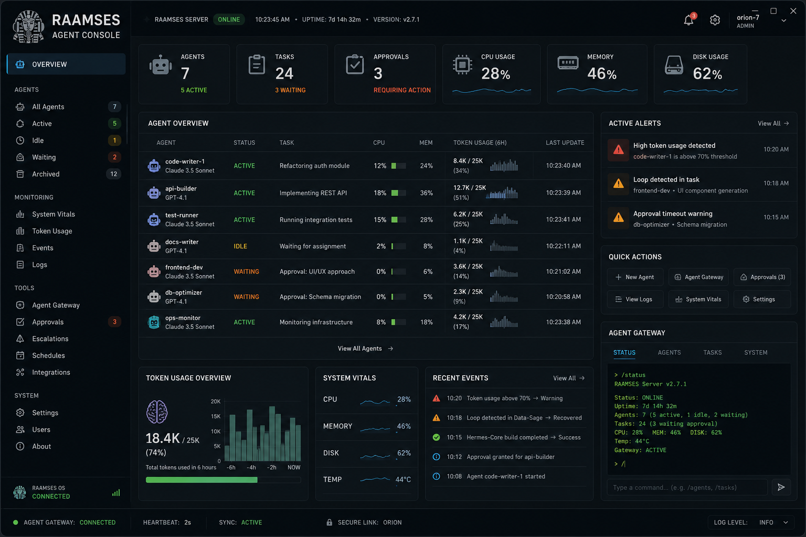
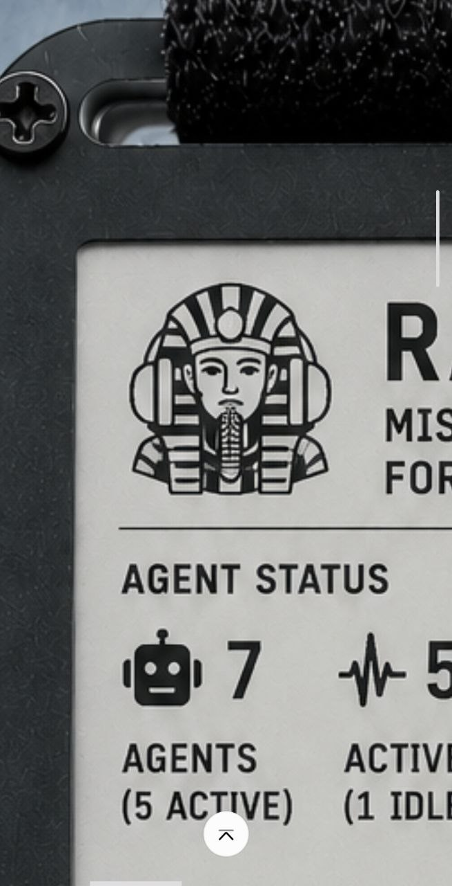

# RAAMSES — Remote AI Agent Monitoring & System Event Supervisor

NOTE
we are almost live!
today's date is...
7/18/2026

Welcome to raamses.io 

We're planning on going live 9-01-2026
We're accepting beta tester applications! 
email support@raamses.io . we need testers with hardware already to be flashed.

Note: if you download any firmware prior to launch, do so at your own risk.

I'll have a python server emulator soon.

Sean 

**Mission Control for AI Agents**

"Friday, 6:12 PM. Your agent needs one decision. Without RAAMSES, it waits until Monday. With RAAMSES, your AI Operations Console vibrates, you tap Option B, and the work keeps going."

Imagine a device sitting on your desk, or an e-paper pager vibrating on your wrist or in your pocket.

🟢 All Agents Operational  
🟡 Claude waiting for approval  
🟠 Token usage abnormal  
🔴 Loop detected  
🔴 Disk space critical

## Ecosystem

RAAMSES Server  
├── Desktop AI Operations Console  
├── CYD AI Operations Console  
├── E-Paper AI Operations Console  
├── Mobile AI Operations Console  
└── Wearable AI Operations Console

Pressing a button immediately opens the details or approval screen. That's instantly understandable.

**Real-time visibility into your agentic systems.**

RAAMSES gives developers and DevOps engineers a beautiful, always-on dashboard for Hermes, Claude Code, and other autonomous agents. No more constantly checking Telegram or email.

**One free display device. Unlimited with a paid license key.**

## Features

- Live agent/subagent count and status
- Token usage tracking (total, today, last hour)
- Project progress and sprint status
- Server health (CPU, memory, disk, uptime)
- Color-coded status bar with smart alerts
- Multiple hardware clients (CYD, ESP32 e-Paper, CardPuter, watches, custom builds)
- C# desktop controller with virtual client for testing
- Event-driven architecture

## Quick Start

1. Download the latest firmware for your device from the Releases page
2. Flash your CYD, ESP32, or other supported hardware
3. Run the RAAMSES server on your Windows or Linux machine
4. The display will automatically connect and show live data

See the [Wiki](https://github.com/texsean/Raamses/wiki) for detailed installation instructions (Windows, Linux, Docker).

## Commercial Licensing

This project is proprietary. Commercial use, redistribution, or derivative works for paid services require explicit permission.

Contact **support@raamses.io** for:

- Unlimited device licenses
- Pre-flashed hardware
- Enterprise support contracts
- Custom development

## Pricing Tiers

**Free**  
One RAAMSES server and 2 consoles (1 hardware display + 1 software display). Perfect for individual developers.

**Pro** ($149.99 Year or $14.99/month)  
Up to 2 server instances with 10 consoles each.

Pre-loaded cconsoles when available at 15% discount.

**Professional** ($499.89/year or $55/month)  
Up to 10 agent instances and 10 devices for corporations.

**Enterprise** (custom pricing)  
24-hour support, unlimited agents.

## Repository Structure

- `/firmware` — Device firmware (CYD, ESP32 e-Paper, Watchy, etc.)
- `/server` — C# RAAMSES.Server desktop application and gateway
- `/docs` — Full documentation and wiki source
- `/enclosures` — 3D printable designs (paused until later sprints)
- `/assets` — Logos, screenshots, and branding

## License

See [LICENSE](LICENSE) — All Rights Reserved. Commercial use requires explicit written permission from Sean Rohde.

## Contact

- Support: support@raamses.io
- GitHub: https://github.com/texsean/Raamses
- Domain: https://raamses.io

**Built with ❤️ by Sean Rohde and the RAAMSES team.**

This project is actively developed. Feedback and non-commercial contributions are welcome.

---
*Last updated: June 2026*
