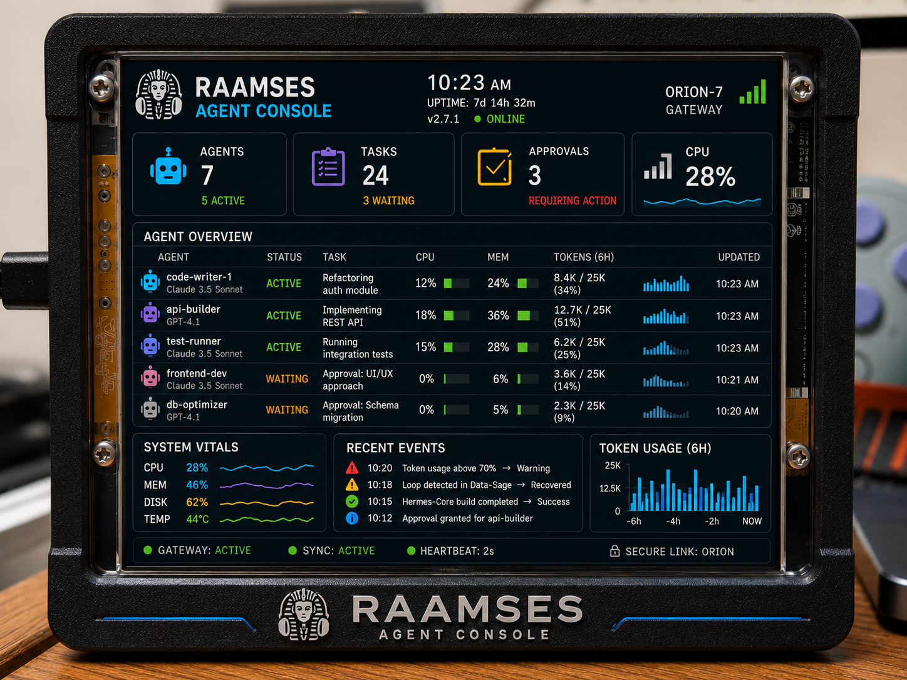
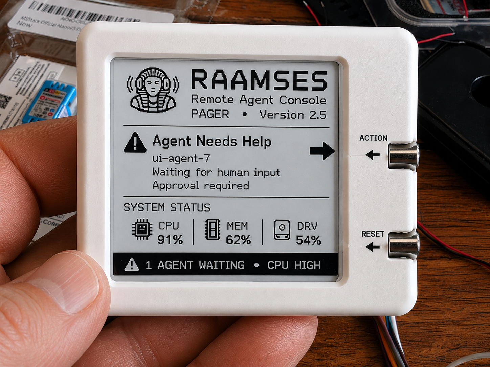

# RAAMSES — Remote AI Agent Monitoring & System Event Supervisor

**NOTE**  
We are almost live!  
Today's date is 7/19/2026.

**Welcome to raamses.io**

We are going live on 10-31-2026. 👻  

We are accepting beta tester applications! Email support@raamses.io. We need testers with hardware already ready to be flashed.

**Note:** If you download any firmware prior to launch, do so at your own risk.  
We have published the full API and include a Python server emulator (see `server-emulator/`) so you can test firmware immediately.

**Sean**

**Desktop AI Agent Console (With Gateway)**

**Agent Console full 3x5" OLED display example:**

**RAAMSES custom Agent Console e-paper pager:**

**Mission Control for AI Agents**

"Friday, 6:12 PM. Your agent needs one decision. Without RAAMSES, it waits until Monday. With RAAMSES, your AI Operations Console vibrates, you select option A, and the work keeps going."

RAAMSES is a device sitting on your desk or an e-paper pager vibrating on your wrist or in your pocket.

**Watchy custom firmware, Agent Console example:**

🟢 All Agents Operational  
🟡 Claude waiting for approval  
🟠 Token usage abnormal  
🔴 Loop detected  
🔴 Disk space critical

## Ecosystem

RAAMSES Server  
├── Desktop AI Operations Console  
├── CYD AI Operations Console  
├── E-Paper AI Operations Console  
├── Mobile AI Operations Console  
└── Wearable AI Operations Console

Pressing a button immediately opens the details or approval screen. That is instantly understandable.

**Real-time visibility into your agentic systems.**

RAAMSES gives developers and DevOps engineers a beautiful, always-on dashboard for Hermes, Claude Code, and other autonomous agents. No more constantly checking Telegram or email.

**What the live console shows**
**Configurable Local LLM Support**  
Choose your own model (`llama3.2:3b`, etc.) or let RAAMSES detect and use an existing one. Perfect for **detecting wasted tokens and inactive agents** without cloud dependency. Performance is guarded so slow models never block the gateway.

**Future Raamses-Native Agents**  
Our own agents will report structured evidence directly. No parsing, no wrappers — maximum accuracy and trust.

## Current Status
- **Firmware** — CYD, ESP32 e-paper watch, configurable software console (emulates any display size/type for testing).
- **Android App** — v1.0.2 APK building automatically on every tagged commit via GitHub CI (see RaamsesAndroid repo).
- **Desktop Console** — Linux htop-style terminal UI in progress (emulates small displays while remaining terminal-friendly).
- **Gateway/Server** — Python emulator with full XML/JSON protocol, scheduled verifier (30s poll), chat pass-through, `/sethome`, and generic gateway mode. C++ Linux reference implementation starting on Pi 5.
- **Verification Engine** — Live in all versions (Python, planned C++). Supports LocalLLM, FILEbased, auto, and blink modes.
- **Testing** — Hardware-independent with configurable software console + nightly automated test reports.

- 
**LAST VERIFIED WORK**  
18 seconds ago

Editing: gateway.cpp  
Process: clang++  
CPU: 61%

“Verified” means the RAAMSES server observed an actual filesystem, process, tool, API, or source-control event — not a sentence supplied by the agent.

**Suggested states:**  
**ACTIVE** — verified event within 2 minutes  
**QUIET** — no verified event for 2–15 minutes

## Smart Verification Engine (SVE)

RAAMSES does not blindly trust the agents self-reports. It periodically polls status **and then independently verifies** using real telemetry (filesystem changes, git commits, process activity, tool calls, test results, token burn rate, etc.).

When discrepancies are detected, RAAMSES immediately escalates via console, pager, or alert with clear evidence.

A local Ollama instance (Qwen2.5 or similar) runs as an independent second brain to detect astray agents, hallucinated progress, subtle drift, or repeated identical claims with no actual output. This makes RAAMSES significantly more trustworthy and sets it apart from simple dashboards.

## Technical Foundation (Public)

- Full XML + JSON protocol (published in `/schemas/`)
- Python XML/JSON emulator (`server-emulator/`) for immediate testing
- Configurable Software Console that can emulate e-paper, CYD, desktop, or any other device via simple XML config files
- Unit test suite + `run-tests.sh` that runs against the emulator and software console in every simulated hardware mode (no physical device required)

**Schemas & API:** https://github.com/texsean/Raamses/tree/master/schemas

The full smart gateway (C# .NET 8 for Windows/Linux with Hermes/Claude integration) lives in the private `RaamsesServer` repository.

**Almost live.** Beta applications are open.

Contact: support@raamses.io

---

*RAAMSES — Powerful oversight for autonomous AI agents.*

## Vision
RAAMSES is more than a monitor. It is the **true mission controller** for autonomous AI agents. an entire suite of agentic tools like no other. No tools offer integrated hardware and software control access with so many devices like Raamses. 

- **v1** — Monitor and control agents from Hermes, Claude, Grok and others with independent verification of their output with web and various hardware & software interfaces all talking to the main Raamses server. no more Token limit reached surprises! Raamses will notify you well in advance when you are exceeding normal usage or about to hit pre set limits when known.

- **v2** — Raamses-native agents that report structured evidence natively (no wrapper gateway/s needed
- , the core gateway will be Raamses using Raamses Agents storing their memory in Raamses format (memory that will be exportable to .ram (raamses formatted) mark up files) which will make adding new agents on new servers pain free!

- **v3** — Agent marketplace where RAAMSES is the OS — every agent plugs directly into your console.

We are already on this trajectory with a launched domain, working firmware, CI-built Android app, Pi 5 Linux gateway in progress, and a verification engine that no one else has.

## Core Differentiator — Anti-Hallucination Verification
Most systems trust what agents say. RAAMSES **asks for status… then independently verifies**.

- Compares agent claims against real evidence (git state, files changed, processes, test results, token usage, logs).
- Uses configurable methodology: LocalLLM (Ollama), FILEbased (user-defined status files), auto, or lightweight blink checks.
- Flags hallucination, loops, drift, or inactivity with confidence score and recommendation.
- “Agent claims 85% complete — verified evidence shows 48%. Mismatch alert.”

This is a feature CTOs, DevOps leads, and CFOs will want yesterday. It is proprietary, private, and runs locally or with your chosen lightweight LLM.

**Beta tester applications are open.** Email support@raamses.io (especially if you have hardware ready to flash).

**Note:** Pre-launch firmware and APKs are provided at your own risk.

## Technical Foundation
- **Protocol** — Clean XML/JSON envelope with capability negotiation. Consoles declare what they can do; the server chooses the right payload (summary for small displays, full data suite for desktop).
- **Schemas** — Published modular XSDs: https://github.com/texsean/Raamses/tree/master/schemas
- **Emulator** — Full-featured Python reference (XML + JSON, scheduled verification, chat pass-through). we Use it to Qa test consoles before all features of the C++ linux server were complete. Now its evolved into the server side UI to the server and to the agents! Imagine htop for agents!
- 
- **Verifier** — Configurable local intelligence. See `verification/ollama_verifier.py` and `raamses-verifier.config`.
- **Repositories**
  - Public (firmware, emulator, schemas, docs): https://github.com/texsean/Raamses
  - Private (server, gateway, internal specs): https://github.com/texsean/RaamsesServer
  - Android: https://github.com/texsean/RaamsesAndroid (CI auto-builds signed APK on versioned commits)

## Quick Start
1. Clone the public repo.
2. Run the emulator: `cd server-emulator && python emulator.py`
3. Run the software console or Android app and point it at the emulator.
4. Test verification by sending agent status with realistic evidence.

**Nightly test reports and 6pm status updates are emailed to support@raamses.io.**

---

**RAAMSES — Evidence-based oversight for the agent economy.**

" it's Wednesday afternoon and the build has failed you give a seemingly innocent prompt to your agent .. 

so.. you issue this prompt :

"Agent, after a commit, wait 30 seconds, then verify that the APK build was successful. repeat every 30s until the build succeeded or failed. if successful, then it is safe to move to the next task. otherwise. investigate the failure, fix it, and try again.."

Unfortunately. you created a loop..

if the build failing is outside of your agents capacity it will try forever..and never notify the human that the build has failed.. 

the next thing you know Friday morning you get an alert that you used up all your tokens and that there's been 327 build attempts and your agent has repeatedly tried to fix a bug over and over repeating the same fix.. and that could have been detected Wednesday a few iterations into the loop.. 

Raamses will catch this after 5 attempts! five fails Raamses will notify you that your agent is in a potential loop.. and after 10, Raamses will instruct your agent to check itself.

*Built with independent verification, configurable local intelligence, and a clear path to native agents and a marketplace.*

---
*All images and branding assets are preserved in the `/logos` and `/marketing` folders.*
